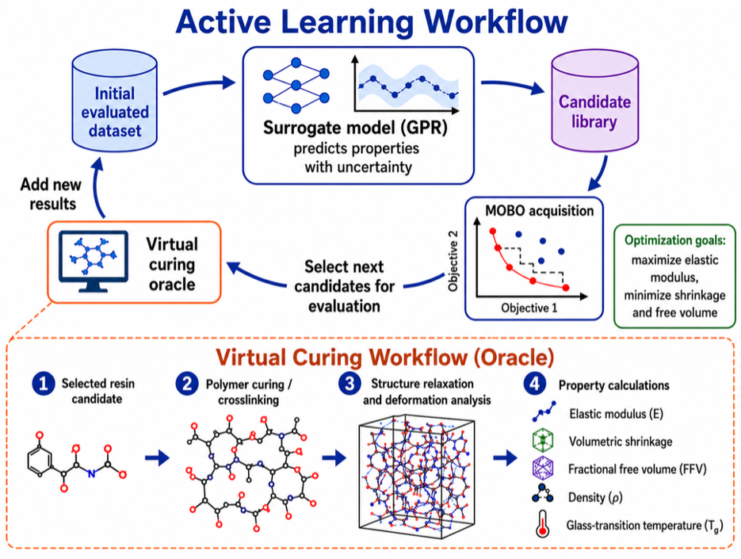

# EloKriti

Chemistry-aware active learning for the discovery of BPA-free dental resin
backbones using molecular-dynamics-derived network properties.

This repository contains the active-learning and multi-objective
Bayesian-optimization code used in:

**Accelerated Discovery of BPA-Free Dental Resin Candidates through
Active Learning of Network-Emergent Properties**

<p align="center">
  
</p>

## Overview

EloKriti uses Gaussian-process surrogate models to prioritize unevaluated
candidate backbones for explicit virtual-curing and molecular-dynamics
evaluation.

The three optimization objectives are:

- maximize elastic modulus;
- minimize volumetric shrinkage;
- minimize fractional free volume.

The surrogate models are used only for candidate selection. Final property
values and Pareto assignments are based on explicit molecular-dynamics
evaluations.

## Repository structure

```text
EloKriti/
├── polymers_bo/
│   ├── data.py
│   ├── surrogate.py
│   ├── bo.py
│   └── suggest.py
├── scripts/
│   └── suggest_next.py
├── images/
│   └── AL_Workflow_Final.png
├── README.md
└── LICENSE
```

## Requirements

The active-learning workflow requires:

```text
numpy
pandas
scipy
scikit-learn
```

Install the required packages using:

```bash
pip install numpy pandas scipy scikit-learn
```

## Input files

EloKriti uses two CSV files:

1. a candidate-pool file containing all candidates available for selection;
2. an evaluated-candidate file containing candidates that already have MD-derived objective values.

The candidate-pool CSV must contain:

```text
reaction_id
reactant_1
molecular_weight_Boltzmann_average
logP_Boltzmann_average
TPSA_Boltzmann_average
normalized_monomer_phi_Boltzmann_average
normalized_backbone_phi_Boltzmann_average
```

The evaluated-candidate CSV must contain the same columns plus:

```text
elastic_modulus
volumetric_shrinkage
ffv
```

Only successfully evaluated candidates with values for all three objectives
are used to train the surrogate models.

## Run candidate selection

From the repository root, run:

```bash
python scripts/suggest_next.py \
  --candidate-csv candidate_pool.csv \
  --evaluated-csv evaluated_clean.csv \
  --output-csv next_candidates.csv \
  --top-k 10 \
  --seed 42 \
  --scalarizations 64
```

The script ranks the unevaluated candidates and writes the selected batch to
`next_candidates.csv`.

After the selected candidates are evaluated using the molecular-dynamics
workflow, add the successful results to the evaluated CSV and run the command
again for the next acquisition round.

## Data availability

This repository contains the active-learning and Bayesian-optimization code
associated with EloKriti.

Publication-associated molecular-dynamics inputs, processed results, and
simulation data will be archived separately in a permanent research-data
repository.

## Citation

If you use this code, please cite:

**Accelerated Discovery of BPA-Free Dental Resin Candidates through
Active Learning of Network-Emergent Properties**

The final journal citation and DOI will be added after publication.

## License

This project is distributed under the MIT License. See `LICENSE`.
